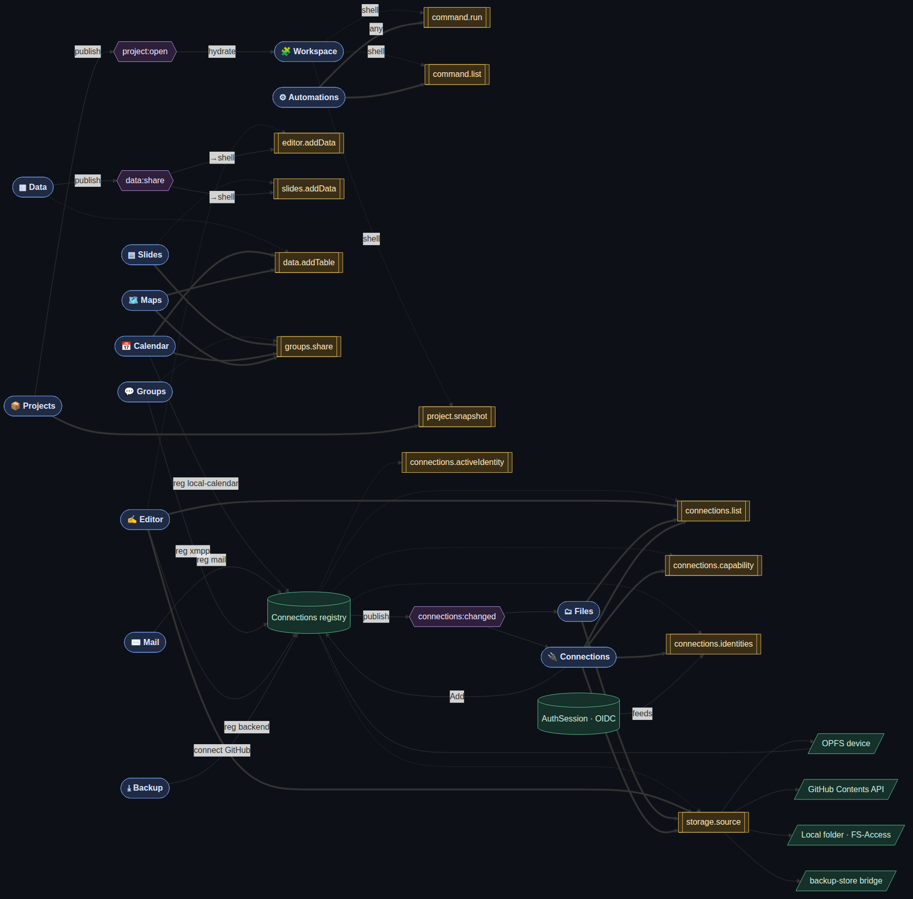
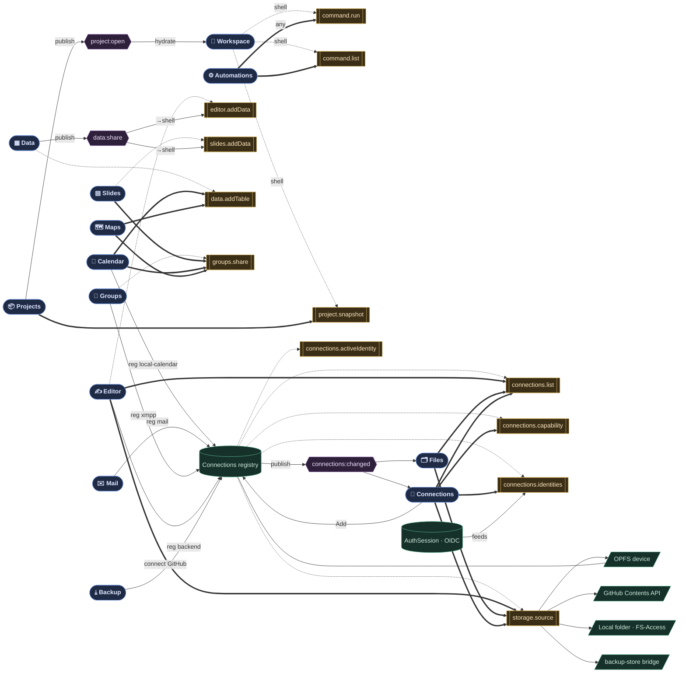

# edot — cross-app capability graph (complete)

Every app, every kernel capability, every bus topic, and every edge between them
— derived from the code (`capabilities.provide`/`invoke`, `bus.publish`/
`subscribe`, and each app's Connections registration). Nothing curated out.

A pre-rendered image is committed alongside this file:



**Node colours:** blue = apps · gold = kernel capabilities · purple = bus topics ·
green = identity & storage.
**Edge legend:** dashed = `provides` (app offers a capability) · solid = `invokes`
(app calls one) · `publish`/notify = bus · `reg…`/`connect` = registers a
Connections account · `feeds`/storage links = identity & storage backing.



## How to read it

- A **capability node** (gold) is a hub: dashed edges in = who provides it, solid
  edges in = who calls it. `groups.share` is provided by **Groups** and invoked by
  **Slides / Calendar / Maps**; `storage.source` is provided by the **Connections
  registry** and invoked by **Editor / Files / Connections**.
- **Bus topics** (purple) fan out: **Data** publishes `data:share`, the shell
  relays it into `slides.addData` + `editor.addData`; **Projects** publishes
  `project:open` to hydrate **Workspace**; the registry publishes
  `connections:changed` to **Connections** + **Files**.
- **Connections registry** (green) is the gravity well: Calendar/Mail/Groups/
  Backup register accounts into it, Editor/Connections connect GitHub into it, and
  it hands out the storage mounts (OPFS/GitHub/local/bridge) that `storage.source`
  returns. **AuthSession** feeds it the OIDC identities.
- **Automations** is the universal client — `command.run` lets a script invoke any
  command (hence any capability) by id.

> Regenerate the image: extract the ```mermaid``` block and run mermaid-cli
> (`@mermaid-js/mermaid-cli`) with a chromium `executablePath`.
